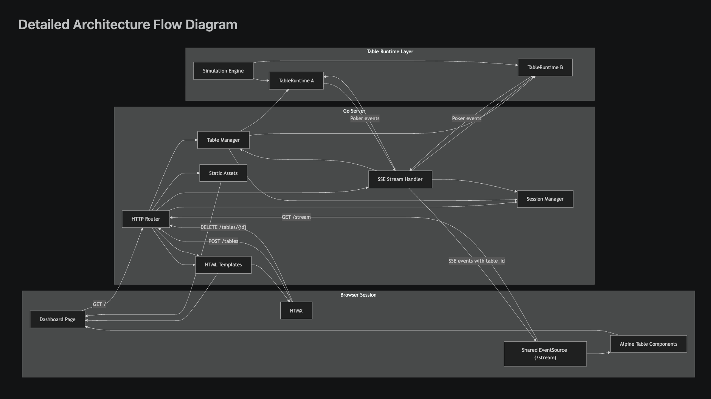

# Poker Table Streaming Dashboard

A Go-based technical assignment that simulates multiple live poker tables in one browser dashboard using server-rendered HTML, HTMX, Alpine.js, and Server-Sent Events.

## Table of Contents

- [1. How to Set Up and Run the Application](#1-how-to-set-up-and-run-the-application)
- [2. What the Application Implements](#2-what-the-application-implements)
- [3. How the Architecture Works](#3-how-the-architecture-works)
- [4. How This Solution Addresses the Evaluation Criteria](#4-how-this-solution-addresses-the-evaluation-criteria)
- [5. Configuration](#5-configuration)
- [6. Testing](#6-testing)
- [7. Project Structure](#7-project-structure)
- [8. Current Trade-offs](#8-current-trade-offs)
- [9. Scalability and Future Improvements](#9-scalability-and-future-improvements)
- [10. Additional Documentation](#10-additional-documentation)

## 1. How to Set Up and Run the Application

### Requirements

- Go 1.26+

### Run the app

```bash
go run ./cmd/server
```

Then open [http://localhost:8080](http://localhost:8080).

By default the server listens on `:8080`. If `PORT` is set in the environment, that value takes precedence. If `HTTP_ADDR` is set, the server uses that full listen address unless `PORT` is also provided.

### Run tests

```bash
go test ./...
```

If you want to match the local test command used during implementation:

```bash
env GOCACHE=/tmp/pokerlab-go-cache /opt/homebrew/bin/go test ./...
```

## 2. What the Application Implements

The current implementation covers:

- session-backed table lifecycle management
- independent server-side runtime per table
- cancellable simulation goroutine per table
- shared session-level SSE streaming with client-side multiplexing by `table_id`
- refresh and reconnect continuity
- automated tests for lifecycle, streaming, cleanup, and edge cases
- centralized runtime configuration for server, session, stream, and simulator tuning

At a high level, a browser session can:

- create and remove poker tables dynamically
- stream simulated table events in near real time
- reconnect after refresh without losing active tables
- enforce a per-session table limit

## 3. How the Architecture Works

At a high level the system works like this:

1. The browser loads `GET /` and receives a server-rendered dashboard shell.
2. HTMX sends `POST /tables` and `DELETE /tables/{id}` for table lifecycle actions.
3. The backend creates one `TableRuntime` per active table.
4. Each runtime runs its own simulation loop and emits poker events.
5. The browser opens one shared `GET /stream` SSE connection for the current session.
6. The frontend routes incoming events to the correct table card using `table_id`.

This keeps server-side table execution independent while avoiding browser HTTP/1.1 per-origin connection limits that would appear with one `EventSource` per table.

### Detailed Architecture Flow Diagram



### End-to-End Request and Data Flow

1. The browser loads `GET /` and the server renders the dashboard shell from Go templates.
2. HTMX sends `POST /tables` or `DELETE /tables/{id}` when the user adds or removes a table.
3. The session manager validates browser ownership and enforces the per-session table limit.
4. The table manager creates or deletes the corresponding server-owned table record.
5. Each active table has its own `TableRuntime`, and the simulation engine drives that runtime in its own goroutine.
6. The browser opens one shared `GET /stream` SSE connection for the current session.
7. The stream handler subscribes to all active runtimes for that session and replays recent history first.
8. Live runtime events are then streamed to the browser with `table_id` in each payload.
9. Alpine routes those incoming events to the correct table card and updates the UI in place.

### Why SSE instead of WebSockets?

This dashboard is read-heavy and primarily streams server-generated updates to the browser. SSE is a better fit because it is:

- simpler to implement and explain
- browser-native
- sufficient for one-way event delivery
- easier to test in a small assignment codebase

### Why one shared browser stream instead of one stream per table?

The first design mapped one `EventSource` to one table. That breaks down in browsers because HTTP/1.1 often limits concurrent connections per origin to around six. Since the assignment requires up to eight tables, a per-table browser stream becomes fragile.

The final implementation uses:

- one shared session-level SSE connection
- application-level multiplexing by `table_id`
- independent server-side runtime per table

This is more robust than depending on HTTP/2 multiplexing being present in every local environment.

## 4. How This Solution Addresses the Evaluation Criteria

### Streaming architecture

Events are delivered through one shared session-level SSE connection instead of one browser stream per table. Each server-side table runtime still emits its own independent event sequence, but the browser receives them through a single transport and routes them by `table_id`. This avoids browser HTTP/1.1 per-origin connection limits while preserving isolated table behavior.

### Resource management

Each table owns a cancellable runtime. Removing a table cancels its runtime, stops further simulation work, and removes it from the registry. Stream subscribers are also unregistered when a client disconnects or when a runtime is stopped. These cleanup behaviors are covered by automated tests.

### Concurrency

Each active table runs its own simulation loop in its own goroutine. Runtime state and event history are owned by that table runtime, and subscriber fan-out is non-blocking so a slow stream consumer does not stall event production for the table.

### HTMX and Alpine.js usage

HTMX is used for what it is best at here: server-driven structural changes such as adding and removing table cards. Alpine.js is used for lightweight client-side state inside each rendered card, especially for reacting to streamed events and updating the live feed. This keeps the frontend small and aligned with the assignment’s intended stack.

### Clean, readable code

The code is organized around clear responsibilities:

- HTTP handlers live in `internal/http`
- session ownership lives in `internal/session`
- table lifecycle lives in `internal/table`
- simulation and runtime logic live in `internal/sim`
- templates and static assets are kept separate from backend logic
- runtime tuning is centralized in `internal/config`

This separation keeps the lifecycle, streaming, and cleanup logic easier to explain, test, and review.

## 5. Configuration

Runtime behavior is configurable through environment variables. Defaults are defined in `internal/config/config.go`.

### HTTP

- `PORT`
  - Example: `8080`
  - Overrides the listen port using `:PORT`
- `HTTP_ADDR`
  - Example: `:8080`
  - Full listen address; ignored if `PORT` is also provided
- `HTTP_READ_TIMEOUT`
  - Example: `5s`
- `HTTP_WRITE_TIMEOUT`
  - Example: `30s`
  - Applies to ordinary request/response handlers; the SSE `/stream` handler clears the per-request write deadline so long-lived streams are not cut off by the server-wide timeout
- `HTTP_IDLE_TIMEOUT`
  - Example: `60s`

### Session

- `SESSION_COOKIE_NAME`
  - Default: `pokerlab_session`
- `SESSION_MAX_TABLES`
  - Default: `8`
  - Controls how many active tables one browser session may own
- `SESSION_COOKIE_SECURE`
  - Example: `true`
  - Useful when deploying behind HTTPS
- `SESSION_COOKIE_MAX_AGE`
  - Example: `24h`

### Stream

- `STREAM_HEARTBEAT_INTERVAL`
  - Default: `15s`
  - Controls SSE keep-alive frequency
- `STREAM_REPLAY_LIMIT`
  - Default: `64`
  - Controls how many recent events are replayed during reconnect
- `STREAM_SUBSCRIBER_BUFFER`
  - Default: `16`
  - Controls shared stream fan-out buffering

### Simulation

- `SIM_INTRA_HAND_DELAY`
  - Default: `550ms`
  - Delay between emitted events within one hand
- `SIM_HAND_PAUSE`
  - Default: `1700ms`
  - Delay between completed hands
- `SIM_HISTORY_LIMIT`
  - Default: `64`
  - Number of recent events retained in memory per table runtime
- `SIM_SUBSCRIBER_BUFFER`
  - Default: `16`
  - Default per-runtime subscriber channel buffer

### Example

```bash
SESSION_MAX_TABLES=8 \
SIM_HISTORY_LIMIT=128 \
STREAM_REPLAY_LIMIT=50 \
SIM_INTRA_HAND_DELAY=800ms \
go run ./cmd/server
```

## 6. Testing

The backend test suite covers:

- session cookie creation and reuse
- max table enforcement
- table create / delete lifecycle
- runtime event generation
- runtime cancellation and cleanup
- shared stream replay and live delivery
- forbidden and missing-table delete paths
- reconnect continuity after refresh
- bounded history and non-blocking subscriber behavior

## 7. Project Structure

```text
cmd/server              application entrypoint
internal/config         centralized runtime configuration
internal/http           routing, handlers, SSE endpoint
internal/session        session cookie and ownership manager
internal/sim            table runtime and simulation engine
internal/table          active table registry
internal/templates      HTML template renderer
web/templates           page and partial templates
web/static              CSS and JavaScript assets
docs                    notes, design doc, roadmap, timesheet
```

## 8. Current Trade-offs

The current implementation intentionally favors clarity over distributed scalability:

- session state is stored in memory
- active table metadata is stored in memory
- each table runtime is an in-process goroutine
- SSE delivery is handled by the same Go process that owns the runtimes

This is a good fit for the assignment because it keeps lifecycle and cleanup behavior easy to reason about, but it is not designed for multi-instance deployment as-is.

## 9. Scalability and Future Improvements

If this project needed to evolve beyond a local single-node assignment, the most useful next steps would be:

### 1. Configuration is already externalized

The project already supports configuration-driven limits and timing, which makes local tuning, review, and future containerized deployment easier.

Examples:

- raise session capacity with `SESSION_MAX_TABLES`
- reduce memory use with `SIM_HISTORY_LIMIT`
- tune reconnect behavior with `STREAM_REPLAY_LIMIT`

That means the next scalability steps can focus on state ownership and deployment topology rather than first untangling hard-coded runtime values.

### 2. Abstract in-memory managers behind interfaces

The HTTP layer currently uses in-memory session and table managers directly. A future iteration should depend on interfaces so implementations can be swapped without rewriting handlers.

Example:

- current: in-memory `SessionManager`
- future: Redis-backed session store

### 3. Persist session and table metadata

The most important data to move out of process memory first would be:

- session ownership
- active table metadata

That would make the app more resilient to restarts.

Example:

- after a process restart, the server could still restore which tables belong to a session

### 4. Introduce an event bus for multi-instance streaming

Today, runtime events only exist inside the process that owns the table goroutine. In a multi-instance deployment, a shared event bus would be needed so stream handlers and runtimes do not have to live on the same node.

Examples:

- Redis Pub/Sub
- NATS
- Kafka

### 5. Add lifecycle hygiene for longer-running deployments

Further production hardening would likely include:

- graceful shutdown
- TTL cleanup for idle sessions and abandoned tables
- structured logging
- metrics for active sessions, tables, runtimes, and stream subscribers

## 10. Additional Documentation

For more detailed reasoning, implementation sequencing, and design trade-offs, see:

- [Initial Notes](docs/01-initial-notes.md)
- [Design Doc](docs/02-design-doc.md)
- [Roadmap](docs/03-roadmap.md)
- [Timesheet](docs/timesheet.md)
